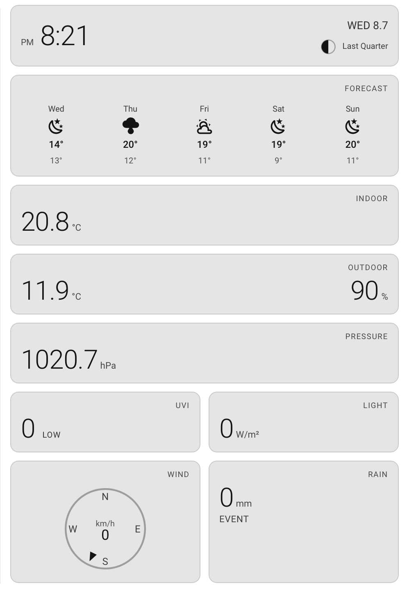
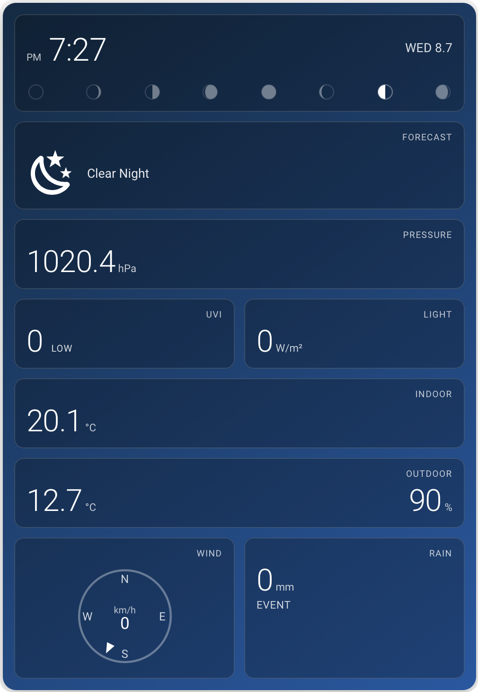
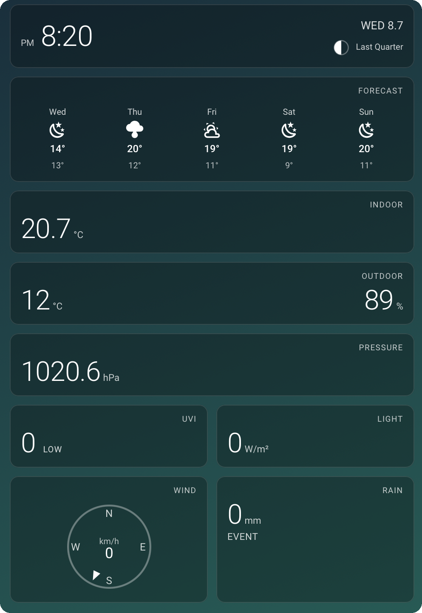

# PRO-V Weather Card

A Lovelace card styled after PRO-V / Ecowitt weather-station consoles: clock and date, current moon phase, 5-day forecast, pressure, UV index, solar radiation, indoor and outdoor temperature/humidity, a wind compass, and rain — laid out like the display on your wall.

<p align="center">
  
  
  
</p>
<p align="center"><sub>Default &middot; Theme (Pastel Teal) &middot; Manual gradient</sub></p>

**Every reading is a GUI-selectable entity.** Built for Ecowitt stations but source-agnostic: point the indoor temperature at any sensor, take the forecast from any `weather.*` entity, mix providers freely. Panels simply hide when their slot isn't configured.

## Features

- **Console layout** — clock with day/date, computed current moon phase with name (no entity needed), 5-day forecast strip (day, condition, high/low) fed live by HA's forecast subscription from any weather entity, pressure, UVI with severity word (LOW → EXTREME), solar W/m², indoor and outdoor temp + humidity, wind compass with live bearing pointer and speed, rain with a configurable label (Event / Rate / Daily — whatever sensor you feed it).
- **Trend arrows** — indoor/outdoor and pressure readings grow rise/fall arrows once the card has watched them for a while (20-minute windows, session-based).
- **Fully GUI-configured** — style and every data slot in the visual editor; sensible auto-discovery for Ecowitt entity naming in the card picker preview.
- **Three style modes** (same convention as the [AirTouch Card](https://github.com/mycrouch/airtouch-card) and [Ecovacs Vacuum Card](https://github.com/mycrouch/ecovacs-vacuum-card)): **Default** (follows your theme), **Theme** (apply any installed theme — e.g. [Gradient Themes](https://github.com/mycrouch/gradient-themes) — to just this card), or **Manual** gradient colours.
- **Single file, no assets** — all glyphs inline SVG, moon phases generated mathematically, responsive two-column layout that stacks in narrow columns.

## Installation

### HACS

1. HACS → menu (⋮) → **Custom repositories** → add `https://github.com/mycrouch/pro-v-weather-card`, category **Dashboard**.
2. Download **PRO-V Weather Card**. The Lovelace resource is registered automatically.

### Manual

Copy `pro-v-weather-card.js` to `config/www/` and add it as a dashboard resource (`/local/pro-v-weather-card.js`, type module).

## Configuration

Everything is in the GUI editor. YAML equivalent:

```yaml
type: custom:pro-v-weather-card
weather: weather.forecast_home
outdoor_temp: sensor.roof_weather_station_outdoor_temperature
outdoor_humidity: sensor.roof_weather_station_humidity
indoor_temp: sensor.roof_weather_station_indoor_temperature
indoor_humidity: sensor.bedroom_humidity        # any sensor, any source
pressure: sensor.roof_weather_station_absolute_pressure
wind_speed: sensor.roof_weather_station_wind_speed
wind_bearing: sensor.roof_weather_station_wind_direction
rain: sensor.roof_weather_station_event_rain
rain_label: Event
uv: sensor.roof_weather_station_uv_index
solar: sensor.roof_weather_station_solar_radiation
theme: Gradient Blue        # or gradient: ["#0d2b45", "#1565c0"], or omit
```

All slots are optional — configure what you have, the rest of the layout adapts.

## The mycrouch card collection

These Home Assistant Lovelace cards share a common design language — a clean **default** look that inherits your active theme, plus a per-card **theme** picker — so they sit together neatly on one dashboard. Pair any of them with **gradient-themes** for 40 ready-made gradient and pastel backgrounds.

| Project | What it is |
| --- | --- |
| [entity-group-card](https://github.com/mycrouch/entity-group-card) | Group any device's entities as a row list or chip grid |
| **pro-v-weather-card** (this card) | Weather-station console — clock, moon, forecast, UV, solar, wind |
| [weather-station-card](https://github.com/mycrouch/weather-station-card) | LCD-console weather station with backlight themes |
| [airtouch-card](https://github.com/mycrouch/airtouch-card) | AirTouch 4/5 AC + zone control |
| [sensibo-thermostat-card](https://github.com/mycrouch/sensibo-thermostat-card) | Sensibo thermostat with mode-coloured backgrounds |
| [ecovacs-vacuum-card](https://github.com/mycrouch/ecovacs-vacuum-card) | Ecovacs/Deebot vacuum with area cleaning |
| [gradient-themes](https://github.com/mycrouch/gradient-themes) | 40 gradient + pastel dashboard themes |

## License

MIT. Weather icon paths from [Material Design Icons](https://pictogrammers.com/library/mdi/) (Apache 2.0).
